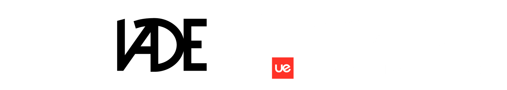

  

[Português](README.pt-pt.md) | English

# IADE Master's Dissertation Guide

A comprehensive resource for IADE master's students to navigate the dissertation process, from topic selection to defense.

## Quick Start

1. [Choosing a Topic](guides/01-choosing-a-topic.md)
2. [Literature Review](guides/02-literature-review.md)
3. [Research Methodology](guides/03-research-methodology.md)
4. [Writing the Dissertation](guides/04-writing-the-dissertation.md)
5. [Citations and References](guides/05-citations-and-references.md)
6. [Defense Preparation](guides/06-defense-preparation.md)

## Resources

- [Digital Libraries & Databases](resources/digital-libraries.md) — Where to find academic papers
- [Bibliography Managers](resources/bibliography-managers.md) — Zotero, Mendeley, and more
- [AI Research Tools](resources/ai-tools.md) — Tools for research and literature review
- [Systematic Literature Review](resources/systematic-literature-review.md) — SLR methodology guides
- [IADE & UE Guidelines](resources/iade-ue-guidelines.md) — Official academic writing guidelines

## LaTeX Templates

Ready-to-use templates in the [`templates/`](templates/) folder:

- **Dissertation Template** → [`templates/dissertation/`](templates/dissertation/)
- **PRISMA Flowchart** → [`templates/prisma-flowchart/`](templates/prisma-flowchart/)

### LaTeX Editors

Tools for writing and compiling your dissertation:

- [LaTeX Editors](guides/tools/latex-editors.md) — Overleaf, Prism (AI), MiKTeX, TeX Live, VS Code

## Articles

Selected research methodology articles in the [`articles/`](articles/) folder.

- [How to Write a Thesis](articles/how-to-write-a-thesis/README.md) — Guides and tips for writing your thesis
- [Systematic Literature Review Articles](articles/slr/README.md) — SLR guides and PRISMA documents

## Contributing

Contributions are welcome! Please open an issue or submit a pull request.

## License

MIT
